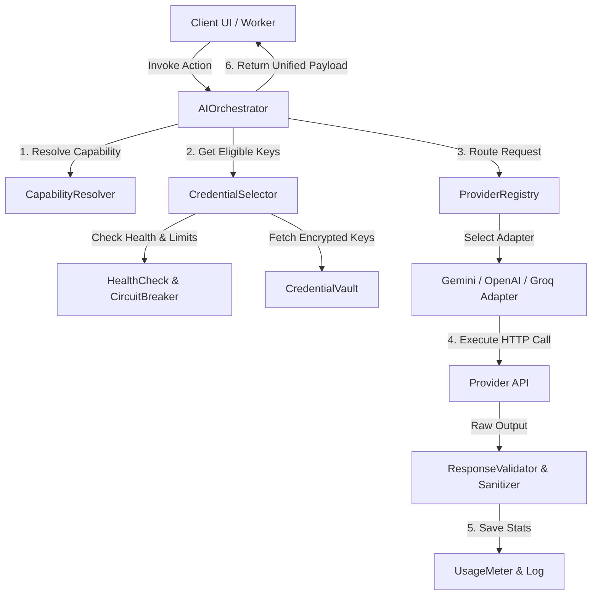

# Desenho Arquitetural — AI Provider & API Key Orchestrator

Este documento detalha a arquitetura proposta para a centralização de Inteligência Artificial e OCR do sistema, unificando segurança, escolha de credenciais, tratamento de falhas e auditoria de consumo.

---

## 1. Visão Geral da Arquitetura Centralizada

A camada `AI Provider & API Key Orchestration` atuará como um middleware unificado que isola completamente o frontend e as funções de domínio (OCR, CRM, Geração) das APIs dos provedores de IA.

---

## 2. Componentes da Arquitetura

### AIOrchestrator

- O ponto de entrada unificado para todas as chamadas de IA do sistema. Recebe o ID da agência, a feature requerida, os dados de entrada (PDF, texto, imagem) e o schema Zod/JSON de saída esperado.
- Coordena o fluxo de execução, retries e fallbacks de provedor.

### CapabilityResolver

- Analisa as restrições da tarefa (ex: "Exige leitura visual de PDF", "Exige geração de imagens") e retorna os provedores e modelos compatíveis (ex: Gemini para PDF direto; Dall-E-3 para imagens).

### CredentialSelector

- Seleciona a credencial ideal para a execução da tarefa baseado em:
  1. Agência proprietária (`agency_id`).
  2. Provedor selecionado.
  3. Status da credencial (saúde, cooldown, circuit breaker).
  4. Custo estimado e limite de quota configurado.
- **Score de Seleção**: Chaves com menor `used_count` e zero erros recentes têm prioridade.

### CredentialVault

- Interface segura que lê chaves criptografadas da tabela `api_keys` ou segredos globais. Executa a descriptografia em memória e nunca expõe as chaves no retorno para o cliente.

### CircuitBreaker

- Monitora as falhas consecutivas de cada chave de API. Se uma chave retornar erro `401` (inválida) ou `429` (cota estourada) consecutivamente por 3 vezes, o disjuntor abre, colocando a chave em `cooldown` por 15 minutos (ou a desabilita se for erro 401).

### UsageMeter

- Grava dados detalhados da chamada (`prompt_tokens`, `completion_tokens`, latência, custo estimado, status HTTP) nas tabelas de logs operacionais de consumo da agência.
