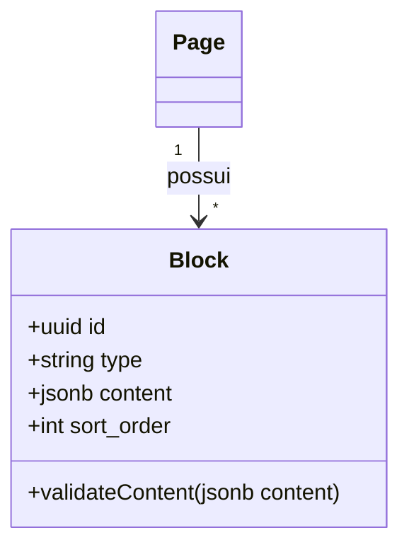

# Framework: CMS & Page Builder Architect

**Propósito:** Fornecer diretrizes operacionais para a construção, manutenção e auditoria do CMS dinâmico (Block-Based Page Builder) do portal público das agências do TravelOS. O CMS do TravelOS deve ser estruturado por dados tipados, evitando trechos gigantes de HTML solto, facilitando a edição visual sem comprometer a segurança ou o desempenho.

---

## 1. Arquitetura de CMS Baseada em Blocos (Schema-Driven)

Todo componente visual exibido nas landing pages ou no blog deve ser registrado como um "Bloco". Cada Bloco é regido por um esquema de dados (Schema JSON) estrito.



1. **Estrutura de Registro do Bloco (Block Registry):**
   - Cada bloco disponível no sistema deve possuir três arquivos ou representações lógicas fundamentais:
     - **O Componente Renderizador (`/portal/blocks/*`):** Componente React puro que lê o JSON e renderiza o HTML otimizado para o visitante.
     - **O Componente Editor (`/admin/blocks/*`):** Componente React administrativo com formulários tipados para edição dos dados do bloco.
     - **O Esquema de Validação (`/schemas/*`):** Um esquema de validação (ex: schema Zod ou JSON Schema) que valida o JSON antes de gravá-lo no banco de dados.

---

## 2. Padrões de Dados e Tabelas de CMS

A tabela que armazena as páginas do portal ou blog deve seguir a seguinte estrutura de governança:

```sql
CREATE TABLE public.cms_pages (
  id UUID PRIMARY KEY DEFAULT gen_random_uuid(),
  agency_id UUID NOT NULL REFERENCES public.agencies(id) ON DELETE CASCADE,
  slug VARCHAR(255) NOT NULL,
  title VARCHAR(255) NOT NULL,
  meta_title VARCHAR(255),
  meta_description TEXT,
  meta_image TEXT,
  blocks JSONB DEFAULT '[]'::jsonb NOT NULL,
  status VARCHAR(20) DEFAULT 'draft' CHECK (status IN ('draft', 'published', 'archived')) NOT NULL,
  version INT DEFAULT 1 NOT NULL,
  published_at TIMESTAMP WITH TIME ZONE,
  updated_at TIMESTAMP WITH TIME ZONE DEFAULT timezone('utc'::text, now()) NOT NULL,
  CONSTRAINT unique_agency_slug UNIQUE (agency_id, slug)
);
```

- **Versionamento de Conteúdo:** Toda alteração publicada deve incrementar a versão da página e manter um log histórico para rollback, se requisitado.
- **Status do Conteúdo:** Alterações feitas no editor do CMS devem ser salvas como `status = 'draft'` e gravadas em um campo temporário de preview, sem afetar o portal público até que a ação explícita de "Publicar" (Publish) seja acionada.

---

## 3. Diretrizes de SEO e Carregamento Rápido (Performance)

1. **Metadados Dinâmicos:**
   - O renderizador do portal público deve injetar tags `<title>` exclusivas, `<meta name="description">`, tags Open Graph (para compartilhamento em redes sociais) e schemas estruturados JSON-LD (ex: `Product`, `Article` ou `FAQPage`).
2. **Otimização de Assets:**
   - Todas as imagens servidas pelo CMS nas landing pages devem passar por otimização automática (redimensionamento responsivo, uso de tags `srcset` e formatos modernos de imagem como `.webp`).
   - Imagens abaixo da dobra de página (below-the-fold) devem usar lazy loading por padrão (`loading="lazy"`).
