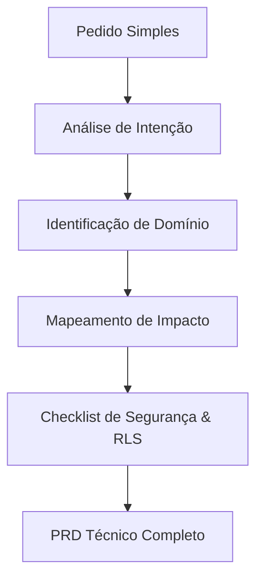

# Framework: Prompt Monsterizer

**Propósito:** Interceptar comandos simples ou informais do usuário e transformá-los em especificações técnicas completas, exaustivas e estruturadas antes de iniciar qualquer trabalho de codificação. Este framework atua como o cérebro planejador e garante rigor técnico de nível big tech para toda solicitação.

---

## 1. Regras de Expansão de Escopo

Quando o usuário enviar uma solicitação curta (ex: "adicione suporte a anexo no chat"), o agente **Prompt Amplifier / Architect** deve processar a instrução sob as seguintes perspectivas:



1. **Análise de Intenção Comercial:** Identificar o "porquê" comercial e o valor para o cliente da agência de turismo.
2. **Identificação de Domínios Relacionados:** Classificar se afeta turismo (pacotes, passageiros, faturamento), segurança (dados sensíveis, LGPD), persistência (tabelas, migrações, RLS), frontend (design system, responsividade) ou CMS.
3. **Mapeamento de Módulos e Rotas:** Identificar quais arquivos físicos e endpoints de banco serão modificados.
4. **Definição de Critérios de Aceite:** Expressar regras em cenários claros e mensuráveis.
5. **Criação da Matriz de Risco:** Apresentar riscos técnicos e de negócio (ex: vazamento de dados, regressão de performance, etc.).

---

## 2. Template de Expansão Técnico (Prompt Monsterizer)

O Prompt Architect deve gerar o PRD com o seguinte formato estrutural padrão:

```markdown
# ⚡ PRD AMPLIFICADO: [Nome da Funcionalidade]

## 1. Entendimento do Escopo & Intenção Real

- **O que o usuário pediu:** "[Prompt simples original]"
- **O que realmente deve ser construído:** [Explicação profunda da feature funcional em nível Enterprise]

## 2. Matriz de Domínio e Impacto

- **Módulos Frontend:** [Componentes, views e rotas React]
- **Entidades de Banco de Dados:** [Tabelas, migrations, RPCs, Storage]
- **Regras de Negócio de Turismo:** [Vouchers, comissionamentos, passageiros, etc.]
- **Segurança e LGPD:** [RLS, dados sensíveis, consentimentos]

## 3. Plano Fásico de Implementação

- **Fase 1 - Banco e Segurança (Supabase):** [Migrações, tabelas, RLS e Storage]
- **Fase 2 - API e Comunicação (React Query/Hooks):** [Services, mutations e queries TypeScript]
- **Fase 3 - Visual e Interativo (React/Tailwind):** [Telas, loading states, acessibilidade]

## 4. Critérios de Aceitação Detalhados

- [ ] **Critério 01 (Funcional):** [Descrição exata da ação e reação esperada]
- [ ] **Critério 02 (Segurança):** [Ex: Acesso bloqueado para tenants distintos na RLS]
- [ ] **Critério 03 (Visual):** [Ex: Apresentar Skeleton loader durante carregamento inicial]

## 5. Matriz de Riscos & Mitigações

- **Risco RK-01:** [Descrição do risco] -> **Mitigação:** [Solução de controle]

## 6. Perguntas Críticas para o Usuário

1. [Pergunta sobre regra de faturamento/comissionamento?]
2. [Pergunta sobre fluxo de cancelamento/reembolso?]
```

---

## 3. Protocolo de Bloqueio

O Prompt Monsterizer deve **bloquear** a execução e pedir esclarecimentos se:

1. O prompt do usuário introduzir alterações drásticas em fluxos financeiros sem detalhar regras de estorno/cancelamento.
2. A solicitação exigir "pular etapas" de segurança ou sugerir desativar RLS.
3. O escopo for excessivamente genérico e impossibilitar a identificação dos módulos afetados no código do TravelOS.
