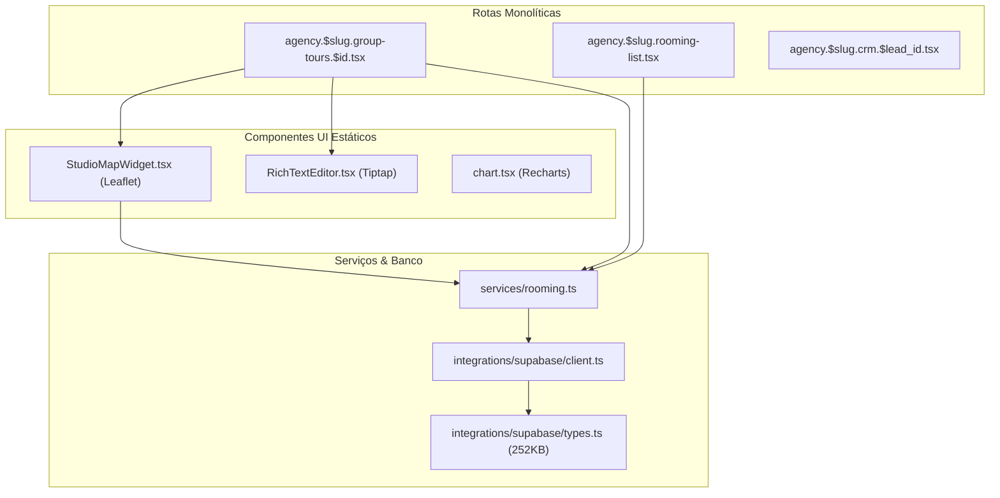

# Mapa de Dependências & Grafo de Importação

Este documento apresenta o mapeamento estrutural das dependências externas e internas do TravelAgencias/TravelOS, identificando gargalos e oportunidades de otimização de escopo.

---

## 📦 Dependências Externas (npm) de Alto Impacto

| Dependência                     | Tamanho Aproximado | Importada em                                                                                      | Uso Principal                              | Classificação / Ação                                                                                  |
| ------------------------------- | ------------------ | ------------------------------------------------------------------------------------------------- | ------------------------------------------ | ----------------------------------------------------------------------------------------------------- |
| `xlsx` (SheetJS)                | ~430 kB (min)      | `src/lib/exportRoomingList.ts`                                                                    | Exportação de planilhas.                   | **Client-only**. Já carregada dinamicamente via import assíncrono. Manter.                            |
| `jspdf`                         | ~386 kB (min)      | `src/components/financial/PaymentReceiptModal.tsx`                                                | Exportação de comprovantes PDF.            | **Client-only**. Já carregada dinamicamente. Manter.                                                  |
| `html2canvas`                   | ~201 kB (min)      | `src/components/financial/PaymentReceiptModal.tsx`, `src/routes/agency.$slug.group-tours.$id.tsx` | Captura de tela do flyer e recibo.         | **Client-only**. Carregada dinamicamente em ambas as rotas. Manter.                                   |
| `react-leaflet` / `leaflet`     | ~160 kB            | `src/components/studio/StudioMapWidget.tsx`                                                       | Renderização do mapa do roteiro no Studio. | **Client-only**. Importado estaticamente em widget. **Ação**: Converter widget em lazy component.     |
| `@tiptap/react` / `starter-kit` | ~420 kB            | `src/components/ui/RichTextEditor.tsx`                                                            | Editor WYSIWYG de termos e políticas.      | **Client-only**. Importado estaticamente no editor. **Ação**: Converter editor em lazy component.     |
| `recharts`                      | ~270 kB            | `src/components/ui/chart.tsx`, rotas do dashboard                                                 | Gráficos do financeiro e CRM.              | **Client-only**. Importado estaticamente nos dashboards. **Ação**: Mover para imports dinâmicos/lazy. |
| `lucide-react`                  | ~85 kB             | Praticamente toda a UI                                                                            | Ícones da aplicação.                       | **Compartilhada**. Vite/Rollup tree-shaking ajuda, mas deve-se auditar imports inteiros.              |
| `@supabase/supabase-js`         | ~90 kB             | `src/integrations/supabase/client.ts`                                                             | Cliente de banco e autenticação.           | **Compartilhada**. Usada no cliente e SSR. Manter.                                                    |

---

## 🔄 Grafo de Acoplamento Interno (Gargalos)

No mapeamento das dependências internas, identificamos o seguinte fluxo de acoplamento:

### 1. O Problema do Grafo Estático

A tabela abaixo mapeia o impacto de importação atual das rotas e componentes monolíticos:

| Dependência Interna       | Importada em                  | Cliente | Servidor | SSR | Tamanho/Impacto   | Carregamento | Ação Sugerida                                                                          |
| ------------------------- | ----------------------------- | :-----: | :------: | :-: | ----------------- | ------------ | -------------------------------------------------------------------------------------- |
| `routeTree.gen.ts`        | `src/router.tsx`              |   Sim   |   Sim    | Sim | ~113 kB (Código)  | Estático     | **Modularizar rotas com `.lazy.tsx`** para separar compilação.                         |
| `types.ts`                | `supabase/client.ts`          |   Sim   |   Sim    | Sim | ~252 kB (Tipagem) | Estático     | Mapeamento grande de tabelas. Reduzir importações desnecessárias em tempo de execução. |
| `RichTextEditor.tsx`      | Rotas de Blog, Políticas, CRM |   Sim   |   Não    | Sim | ~420 kB (Tiptap)  | Estático     | **Lazy load component** com suspense.                                                  |
| `StudioMapWidget.tsx`     | Seção de Mapa do Studio       |   Sim   |   Não    | Sim | ~160 kB (Leaflet) | Estático     | **Lazy load component** com suspense.                                                  |
| `PaymentReceiptModal.tsx` | Detalhe da Excursão           |   Sim   |   Não    | Sim | Médio             | Estático     | **Lazy load modal** (import dinâmico).                                                 |

---

## 🚫 Acoplamentos de Fronteiras Identificados

1. **Leaflet no SSR**: O componente `StudioMapWidget.tsx` tenta carregar estilos do Leaflet (`import "leaflet/dist/leaflet.css"`) e pacotes do Leaflet diretamente durante o SSR. Isso gera a necessidade de mocks em tempo de execução SSR ou polui o heap do servidor, pois o Leaflet exige o objeto `window` global (DOM).
2. **Recharts no Dashboard Primário**: O chunk primário é forçado a processar a biblioteca de gráficos pesada Recharts durante o primeiro carregamento da página index da agência, atrasando a renderização interativa (First Input Delay).
3. **Mapeamento Monolítico de Serviços**: A pasta `src/services/` (ex: `proposals.ts` e `rooming.ts`) compartilha imports contendo lógica tanto de seleção como de mutação, sem segregação clara de interfaces de read/write.
