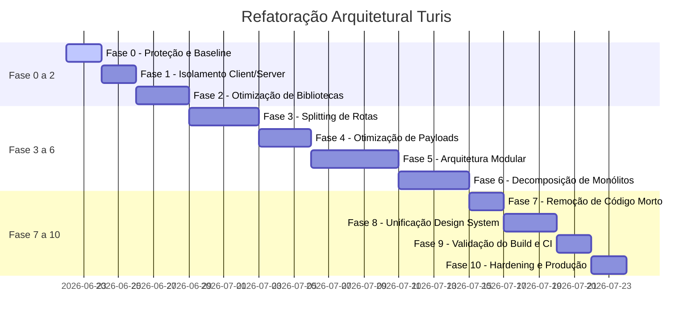

# Plano Diretor de Refatoração (Master Refactor Plan)

Este documento descreve as 11 fases de execução (de Fase 0 a Fase 10) para a refatoração, modularização e estabilização do TravelAgencias/Turis.

---

## 📅 Cronograma de Fases

---

## 🛠️ Detalhamento das Microfases

### Fase 0 — Baseline e Proteção

- **Objetivos**: Proteger a base existente contra regressão antes de qualquer alteração de código.
- **Tarefas**:
  1. Criar o plano de testes de caracterização (ver `08_COMPATIBILITY_TEST_PLAN.md`).
  2. Mapear o grafo inicial de dependências e documentar o baseline de memória de 8GB.

### Fase 1 — Fronteiras Client/Server

- **Objetivos**: Garantir segurança e isolamento entre navegador e servidor.
- **Tarefas**:
  1. Instalar a diretiva `'server-only'` em arquivos chave da pasta `src/server/` ou services sensíveis.
  2. Isolar as chamadas diretas a dependências de DOM (`window`, `document`) em módulos específicos protegidos com verificação de ambiente ou carregamento dinâmico.

### Fase 2 — Bibliotecas Pesadas

- **Objetivos**: Eliminar bibliotecas pesadas do bundle inicial de carregamento da página.
- **Tarefas**:
  1. Revisar as importações de `html2canvas`, `jsPDF`, `xlsx` para garantir que ocorram exclusivamente em chamadores assíncronos (`import()`) dentro de funções disparadas por eventos do cliente.
  2. Modificar o carregador do editor e mapas no Proposal Studio para suspensão preguiçosa.

### Fase 3 — Rotas e Chunks

- **Objetivos**: Implementar divisão de código por rotas no TanStack Router.
- **Tarefas**:
  1. Refatorar as maiores rotas do sistema, dividindo-as em arquivos `route.tsx` e `route.lazy.tsx`.
  2. Migrar os componentes das páginas das rotas para seus respectivos arquivos `.lazy.tsx`, mantendo na rota estática apenas o loader de dados e os contratos de parâmetros.

### Fase 4 — Data Payloads (Otimização Contábil e de Consultas)

- **Objetivos**: Reduzir a transferência desnecessária de grandes dados em listagens.
- **Tarefas**:
  1. Substituir queries gerais `select("*")` por projeções explícitas contendo apenas os campos consumidos pela tabela.
  2. Criar RPCs em banco de dados para agrupar e calcular dinamicamente relatórios contábeis, ROI e faturamento de contingência (Vault), em vez de processar arrays de milhares de transações no cliente.

### Fase 5 — Domínios (Arquitetura Modular Canônica)

- **Objetivos**: Migrar a estrutura do projeto para a arquitetura modular baseada em domínios.
- **Tarefas**:
  1. Criar a estrutura física `/src/modules/` e mover a lógica contida em `routes` e `services` para subpastas dedicadas a domínios (crm, proposals, trips, groups, contracts, finance).
  2. Encapsular a lógica interna de cada módulo, permitindo a comunicação entre eles apenas por meio de suas APIs públicas ou adaptadores.

### Fase 6 — Monólitos

- **Objetivos**: Decompor componentes com mais de 700 linhas de código.
- **Tarefas**:
  1. Refatorar `agency.$slug.group-tours.$id.tsx` e `agency.$slug.crm.$lead_id.tsx`, dividindo-os em subcomponentes menores de apresentação, containers e hooks customizados.

### Fase 7 — Código Legado/Morto

- **Objetivos**: Eliminar código duplicado e arquivos órfãos sem referências ativas.
- **Tarefas**:
  1. Executar ferramentas de análise estática para identificar hooks, schemas e componentes não importados por nenhuma rota.
  2. Limpar referências mortas após migração segura pelo método Strangler.

### Fase 8 — Design System

- **Objetivos**: Consolidar estilos consistentes e neutros (Flat Premium).
- **Tarefas**:
  1. Validar e unificar botões, inputs, modais e badging em componentes compartilhados sob `src/components/ui/`.

### Fase 9 — Build e CI

- **Objetivos**: Validar o build sem necessidade de limites de heap elevados.
- **Tarefas**:
  1. Rodar `npm run build` com memória padrão e testar se a minificação e processamento SSR terminam sem erros de heap limite.

### Fase 10 — Hardening

- **Objetivos**: Validar segurança multi-tenant de ponta a ponta.
- **Tarefas**:
  1. Executar auditoria de RLS com múltiplos usuários clientes para certificar isolamento de privacidade de dados.
