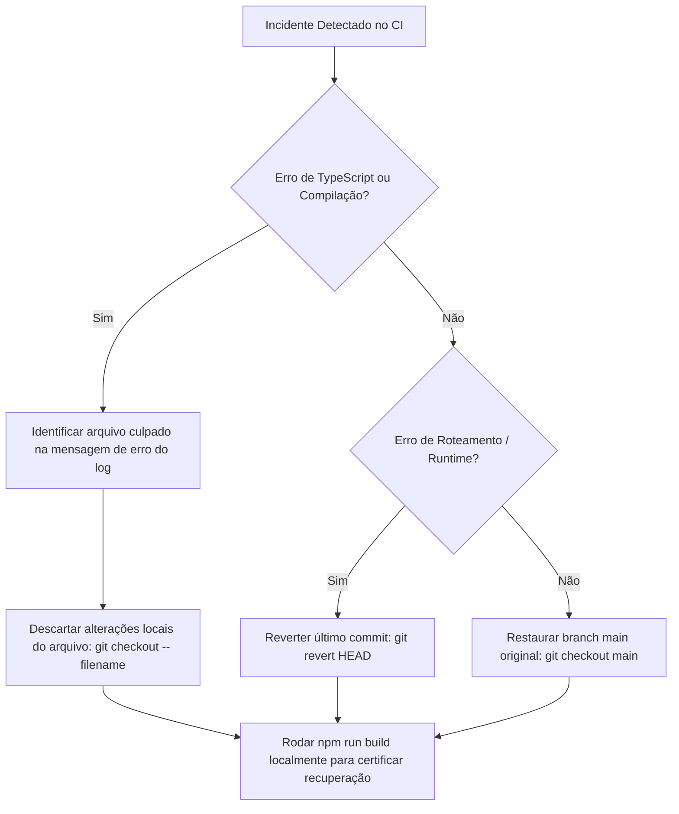

# Plano de Contingência & Rollback (Plano de Recuperação Rápida)

Este documento descreve os procedimentos de contingência e restauração rápida em caso de falhas críticas, quebras de compilação ou regressões funcionais durante qualquer etapa do plano de refatoração.

---

## 🛡️ Estratégia de Versionamento e Checkpoints

Para garantir reversibilidade instantânea de código:

1. **Ramificações Isoladas (Feature Branches)**:
   - Nenhuma alteração da refatoração será cometida diretamente na branch `main` de produção.
   - Cada uma das Fases (Fase 1 a Fase 10) terá sua própria branch separada (ex: `refactor/fase-3-code-splitting`).
2. **Commits Atômicos por Rota**:
   - Cada rota ou componente refatorado receberá um commit individual com mensagem descritiva (ex: `refactor: split agency group tours route into lazy component`). Isso permite usar `git cherry-pick` ou `git revert` de forma cirúrgica.
3. **Checkpoints de Build**:
   - A cada arquivo modificado, o typecheck (`npm run typecheck`) deve ser verificado localmente.

---

## 💾 Plano de Restauração de Banco de Dados

Embora as alterações arquiteturais desta refatoração foquem majoritariamente na camada de código e organização de rotas/front-end, a Fase 4 prevê a criação de novas RPCs e views de otimização contábil.

- **Procedimento de Backup**:
  - Antes de aplicar qualquer migração SQL nova na base de dados de teste ou staging, execute uma exportação do schema do banco de dados e dados críticos:
    ```bash
    supabase db dump --local -f schema_backup.sql
    ```
- **Procedimento de Reversão SQL**:
  - Toda migração adicionada na pasta `supabase/migrations/` deve acompanhar instruções de reversão claras (bloco `DOWN`) comentadas no próprio arquivo ou em script local de reversão.
  - Para reverter alterações locais em banco de dados:
    ```bash
    supabase db reset
    ```

---

## 🚨 Fluxo de Ação em Caso de Incidente

Se o build quebrar ou testes de regressão falharem em ambiente de staging:



### Comandos Rápidos de Emergência (Git):

- **Descartar todas as modificações não commitadas**:
  ```bash
  git reset --hard HEAD
  git clean -fd
  ```
- **Voltar para o commit baseline original**:
  ```bash
  git checkout 2ac19ccef0ee019db450238f51b6bf4efa3297ac
  ```
- **Restauração de dependências limpas**:
  ```bash
  rm -rf node_modules dist .output
  npm ci
  ```
