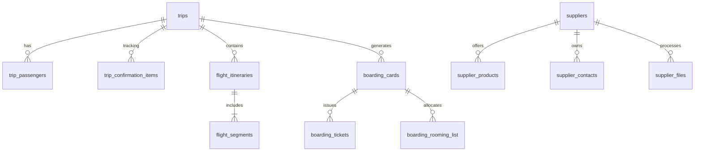

# 01. Mapa Completo de Arquitetura e Domínios

Este documento descreve a topografia completa do sistema do TravelAgencias/TravelOS em seu estado atual, mapeando rotas, tabelas, serviços, portais e integrações.

---

## 1. Topografia de Rotas e Navegação

### 1.1 Sidebar Principal (`AppSidebar.tsx`)

A sidebar foi organizada de acordo com o design Light Editorial SaaS em áreas distintas de trabalho:

- **Dashboard:** Painel principal com widgets operacionais de conferência e métricas.
- **Dia a Dia:** `daily-tasks` (Tarefas), `calendar` (Agenda), `omnichannel` (Central de Chat & E-mails).
- **Vendas & CRM:** `crm` (Negociações & Leads), `proposals` (Orçamentos & Propostas), `contracts` (Lista de Contratos Globais).
- **Viagens:** `trips` (Gestão Geral de Viagens), `vouchers?tab=flight_audit` (Fila global de voos), `boarding` (Kanban Geral de Embarques).
- **Grupos:** `group-tours` (Excursões & Grupos), `bus-layouts` (Modelagem de Frotas/Poltronas).
- **Clientes & Parceiros:** `clients` (Lista de Clientes/Passageiros), `corporate` (Módulo Corporativo / RFPs), `suppliers` (Catálogo de Fornecedores).
- **Financeiro:** `financial` (DRE, Caixa, Faturamento).
- **Suporte & Vistos:** `support` (Painel de Suporte/Tickets), `visas` (Requisitos Consulares).
- **Site & Marketing:** `portal` (Editor Visual CMS do Site), `competitors` (Monitoramento de Concorrência).
- **Identidade & Templates:** `brand` (Brand Kit, Cores e Tipografias), `destination-intelligence` (Gestão de Dicas de Destino).
- **Gestão Admin:** Configurações de Empresa, Equipe, Design System, Conexões e Faturamento de Planos.

### 1.2 Sub-navegação Contextual da Viagem (`trips.$id.tsx` -> 11 Abas)

Ao acessar uma viagem específica, o sistema carrega o layout de sub-navegação com as seguintes rotas:

1. **Visão Geral** (`agency.$slug.trips.$id.index`): Detalhes da venda, metas, e status.
2. **Passageiros** (`agency.$slug.trips.$id.passengers`): Lista de passageiros e status de seus documentos.
3. **Financeiro** (`agency.$slug.trips.$id.financial`): Parcelamentos, faturas e fluxo de lançamentos da viagem.
4. **Aéreos** (`agency.$slug.trips.$id.flights`): Versionamento de itinerários de voos, diff engine e bilhetes de voos associados.
5. **Hospedagem** (`agency.$slug.trips.$id.lodging`): Hotéis, check-in/checkout, regime de alimentação e estrelas.
6. **Contrato** (`agency.$slug.trips.$id.contract`): Visualização do contrato, snapshots e aceites jurídicos.
7. **Confirmação** (`agency.$slug.trips.$id.confirmation`): Listagem de códigos localizadores normalizados por tipo de serviço.
8. **Voucher** (`agency.$slug.trips.$id.vouchers`): Studio de vouchers e templates de histórias/A4.
9. **Check-in & Embarque** (`agency.$slug.trips.$id.boarding`): Kanban e status individual de embarque do passageiro.
10. **Destino & Segurança** (`agency.$slug.trips.$id.destination`): Cartões de saúde, visto, clima e moedas.
11. **Histórico** (`agency.$slug.trips.$id.history`): Linha do tempo auditável de alterações na viagem.

---

## 2. Dicionário de Dados Operacional (Tabelas Ativas)

### 2.1 Core de Viagem

- **`trips`**: Tabela principal. Adicionados campos `trip_type` (individual/group/corporate), `lifecycle_status` (14 estados de ciclo de vida), `group_tour_id`, `booking_reference`, `assigned_agent_id` e `portal_enabled`.
- **`trip_passengers`**: Passageiros associados à viagem, controle de KYC/documentos e assinaturas.
- **`trip_confirmation_items`**: Armazena o registro de localizadores e status por tipo de serviço (`flight`, `hotel`, `transfer`, `insurance`, `cruise`, `tour`, `other`).

### 2.2 Segmentação Aérea e Reconciliação

- **`flight_itineraries`**: Guarda o cabeçalho e a versão (`version`) de cada itinerário sugerido, contratado ou confirmado.
- **`flight_segments`**: Trechos específicos de voos contendo aeroportos, datas, horários, localizador (PNR), franquia de bagagem e terminal.

### 2.3 Operações de Embarque e Hospedagem

- **`boarding_cards`**: Cartão de embarque ( Kanbans operacionais). Armazena dados de hospedagem, transfers, guias e observações de forma desnormalizada para simplificação de render.
- **`boarding_tickets`**: Bilhetes ou ingressos individuais com tipo (ex: `airline`), localizador individual e status de emissão.
- **`boarding_rooming_list`**: Quartos de hotéis contendo número, tipo, hotel, datas, e passageiros alocados (JSONB).

### 2.4 Catálogo e Supplier Intelligence

- **`suppliers`**: Fornecedores. Estendido com dados de SLA, rating, markup/comissão, tags, website, etc.
- **`supplier_products`**: Tarifários de quartos de hotéis, tours e serviços catalogados por fornecedor.
- **`supplier_contacts`**: Agenda múltipla de contatos (reservas, emergências, comercial).
- **`supplier_files`**: PDFs e imagens de contratos/tarifários com dados estruturados de OCR (`ocr_data`).

### 2.5 Destinos e Cláusulas Contratuais

- **`destination_info`**: Repositório de informações de dicas e segurança de destinos.
- **`contract_clauses`**: Biblioteca dinâmica de cláusulas contratuais versionadas e ordenadas.

---

## 3. Camada de Serviços e Integrações

### 3.1 Services do Frontend (`src/services/`)

- **`trip-aggregate.ts`**: Unifica consultas de Viagem, Passageiros, Boarding Cards e Financeiro em um único payload `TripAggregate`.
- **`flight-reconciliation.ts`**: Faz o CRUD de itinerários aéreos e segmentos, gerencia ativação de versões e executa o **motor de diff determinístico** no frontend.
- **`trip-confirmation.ts`**: CRUD de códigos localizadores da viagem e validação de confirmação de itens críticos.
- **`rooming.ts`**: Gerenciamento de alocação de quartos na tabela `boarding_rooming_list`.
- **`audit.ts`**: Injeta registros estruturados na tabela global `audit_log`.

### 3.2 Conectores de APIs Externas

- **Supabase Client SDK:** Gerenciamento de sessões, Storage e queries Postgres.
- **Gemini-1.5-Flash (via Edge Function):**
  - `supplier-ocr-extractor`: Extrai contatos, produtos e metadados de PDFs de fornecedores.
  - `destination-intelligence`: Gera dicas de destinos baseadas em IA.
- **Resend & Gmail Sync (via Edge Functions):** Disparadores de e-mails para fornecedores/clientes no painel de suporte.
- **GDS Infotravel:** Integração de voos e hotéis no builder de propostas.
