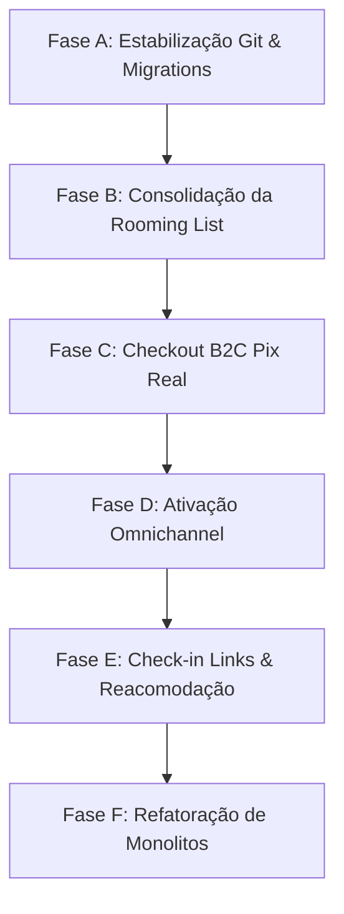

# 13. Plano Mestre de Correção por Fases

Este plano de ação reordena as fases corretivas com base em dependências técnicas estritas e gravidade dos problemas detectados. **Nenhuma alteração de código ou banco deve ser feita antes de autorização explícita de cada fase.**

---

## 1. Fases do Plano de Correção

---

## Fase A — Estabilização Git & Migrations (Prioridade Crítica)

- **Problema Comprovado:** Migrations locais `20260624*` aplicadas na produção remota, mas não rastreadas pelo Git (diretório sujo).
- **Causa Raiz:** Desenvolvimento paralelo executando comandos diretamente na produção sem stageamento de arquivos.
- **Impacto:** Riscos de quebra de build e sincronia em CI/CD.
- **Ações:**
  1. Stagear e commitar os arquivos de migrations locais:
     - `supabase/migrations/20260624000001_trip_confirmation_items.sql`
     - `supabase/migrations/20260624000002_boarding_cards_hotel_stars.sql`
     - `supabase/migrations/20260624000003_flight_reconciliation_schema.sql`
     - `supabase/migrations/20260624000004_client_view_policies.sql`
  2. Commitar os arquivos modificados da sub-navegação da viagem.
- **Critério de Pronto:** Diretório Git limpo (`working tree clean`) e typecheck local sem erros.

---

## Fase B — Consolidação da Rooming List (Prioridade Alta)

- **Problema Comprovado:** Dupla fonte de verdade para alocação de quartos: coluna JSONB em `group_tours` vs tabela normalizada `boarding_rooming_list`.
- **Causa Raiz:** Decisão de design antiga mantendo compatibilidade visual no editor de grupos.
- **Ações:**
  1. Criar script de migração de dados no banco de dados para converter qualquer registro restante na coluna `group_tours.rooming_list` para a tabela normalizada `boarding_rooming_list`.
  2. Ajustar a UI de grupos (`group-tours.$id.tsx`) para ler e gravar dados utilizando o service `rooming.ts` (tabela normalizada).
  3. Criar migration SQL para dar `DROP` na coluna `rooming_list` de `group_tours`.
- **Critério de Pronto:** Edição de quartos em grupos refletindo instantaneamente na view de embarques. Ausência da coluna JSONB no banco de dados.

---

## Fase C — Integração Real de Checkout B2C Pix (Prioridade Alta)

- **Problema Comprovado:** O upload de comprovante de Pix no checkout público do roteiro (`p.$agency_slug.tour.$id.tsx`) é mockado.
- **Causa Raiz:** Falta de integração com o bucket de Storage.
- **Ações:**
  1. Configurar bucket de Storage público/protegido para comprovantes (`payment-receipts`).
  2. Ajustar `handleFileUpload` para ler o arquivo do input e realizar `supabase.storage.from("payment-receipts").upload()`.
  3. Injetar a URL pública do comprovante no campo `receipt_url` da inscrição do grupo (`group_tour_enrollments`).
  4. Adicionar checkbox de consentimento LGPD no formulário público.
- **Critério de Pronto:** Fazer checkout de excursão, subir um PDF real de comprovante e atestar que o arquivo está gravado no Storage e referenciado na inscrição.

---

## Fase D — Ativação Omnichannel (Prioridade Alta)

- **Problema Comprovado:** A central de suporte de tickets permite digitar mensagens, mas o envio real via Gmail/Resend está mockado.
- **Ações:**
  1. Ajustar o handler `sendReply` em `support.$ticket_id.tsx`.
  2. Adicionar chamadas HTTP para disparar a Edge Function `gmail-send` ou o serviço de despacho do Resend ao enviar mensagens.
- **Critério de Pronto:** Enviar uma mensagem na central do admin do Turis e ver o e-mail físico chegar na caixa de entrada do cliente final.

---

## Fase E — Check-in Links & Reacomodação (Prioridade Média)

- **Problema Comprovado:** Ausência das tabelas `checkin_links` e `boarding_events` na produção e controle manual estático de check-ins.
- **Ações:**
  1. Criar e aplicar migrations para as tabelas `checkin_links` e `boarding_events`.
  2. Desenvolver a lógica de montagem dinâmica de links de cias aéreas em `airline-deeplinks.ts` baseado em PNR e aeroporto.
  3. Integrar o widget de reacomodação e alternativas de voo no Portal do Cliente móvel.
- **Critério de Pronto:** Passageiro acessa portal, clica em "Check-in LATAM" e é redirecionado com os parâmetros corretos pré-preenchidos.

---

## Fase F — Refatoração de Monolitos (Prioridade Baixa)

- **Problema Comprovado:** Arquivo `client.trips.$id.tsx` com mais de 1900 linhas acumulando abas, banners e widgets.
- **Ações:**
  1. Separar o arquivo em sub-componentes específicos na pasta `src/components/portal/`.
- **Critério de Pronto:** Build limpa e tamanho de arquivo do roteador reduzido para menos de 400 linhas.
