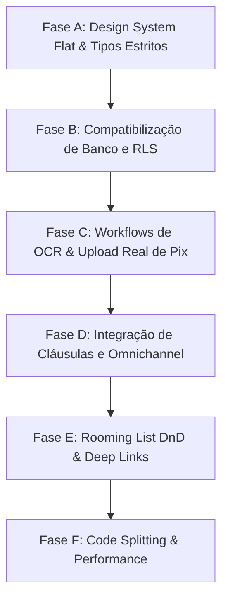

# 08. Plano Mestre de Estabilização - TravelOS

Este documento apresenta o plano estratégico para estabilizar, compatibilizar e otimizar todos os módulos e integrações do TravelOS de forma faseada e segura.

---

## 1. Cronograma Geral das Fases de Estabilização

Para minimizar riscos operacionais e garantir a estabilidade do código, dividimos o plano em 6 fases lógicas, com dependências estruturadas:

---

## 2. Detalhemento Completo das Fases

### Fase A — Design System Flat & Tipos Estritos

- **Objetivo:** Remover sombras indevidas de Radix/Tailwind, resolver flicker visual do Brand Kit e tipar estritamente parâmetros JSONB nas RPCs.
- **Componentes Afetados:** `SlimSidebar`, `Reconciliation`, `BoardingCards`, `VoucherStudio`, `useAgency` context.
- **Ações:**
  1. Adicionar override global `box-shadow: none !important;` no `styles.css`.
  2. Implementar cache síncrono no `localStorage` no `agency-context.tsx` para evitar flicker.
  3. Adicionar check-up tipográfico `document.fonts.ready` em exportadores de PDF.
  4. Remover `@ts-ignore` em `auth.onboarding.tsx` e tipar o JSONB de horas de funcionamento.

### Fase B — Compatibilização de Tabelas de Banco e RLS

- **Objetivo:** Sincronizar tipos de IDs e campos em tabelas recém-migradas (`supplier_files`, `supplier_products`, `boarding_tickets`).
- **Componentes Afetados:** `suppliers.$id.tsx`, `m.checkin.$token.tsx`.
- **Ações:**
  1. Substituir referências de string por IDs reais com FKs de integridade referencial nas consultas Supabase.
  2. Validar que as políticas de RLS de clientes anônimos (`client_view_policies`) estão habilitadas e funcionando.

### Fase C — Workflows Reais de Ingestão OCR & Pix Upload

- **Objetivo:** Integrar uploads reais de comprovantes no checkout público e preenchimento de contatos/produtos pelo OCR de vouchers.
- **Componentes Afetados:** `p.$agency_slug.tour.$id.tsx` (Checkout), `suppliers.$id.tsx` (OCR).
- **Ações:**
  1. Substituir a simulação (progress bar fake) do Pix pelo upload físico do PDF no bucket `receipts` usando Supabase Storage Client.
  2. Implementar inserções reais de produtos e contatos no banco ao confirmar dados extraídos via OCR.

### Fase D — Omnichannel Real e Biblioteca de Cláusulas

- **Objetivo:** Acionar disparos reais do Gmail/Resend nas respostas de tickets de suporte e integrar o gerador de contratos com as cláusulas dinâmicas.
- **Componentes Afetados:** `support.$ticket_id.tsx`, `agency.$slug.trips.$id.contract.tsx`.
- **Ações:**
  1. Descomentar e parametrizar a chamada da Edge Function `gmail-send` no chat de suporte.
  2. Alterar o gerador de contratos para ler da tabela `contract_clauses` e salvar snapshots em `trip_contracts.clause_snapshot`.

### Fase E — Rooming List DnD e Airline Deep Links

- **Objetivo:** Implementar UI de arrastar e soltar (Drag and Drop) para alocação de quartos e gerar URLs de check-in automatizadas para Azul, GOL e LATAM.
- **Componentes Afetados:** `agency.$slug.group-tours.$id.tsx`, `m.checkin.$token.tsx`.
- **Ações:**
  1. Criar interface de arrastar passageiros para os quartos do hotel usando a biblioteca `dnd-kit`.
  2. Criar a utility `airline-deeplinks.ts` para montar URLs dinâmicas com PNR e sobrenome do cliente.

### Fase F — Otimização e Performance de Build

- **Objetivo:** Fatiar componentes monolíticos (`client.trips.$id.tsx`), aplicar dynamic imports para reduzir bundle de build e prevenir erros de Heap Memory.
- **Componentes Afetados:** `client.trips.$id.tsx`, `VoucherStudio.tsx`, `package.json`.
- **Ações:**
  1. Extrair abas operacionais do portal do cliente para componentes filhos focados.
  2. Configurar code-splitting no Vite para carregar bibliotecas grandes como `xlsx` e `jspdf` de forma assíncrona sob demanda.
