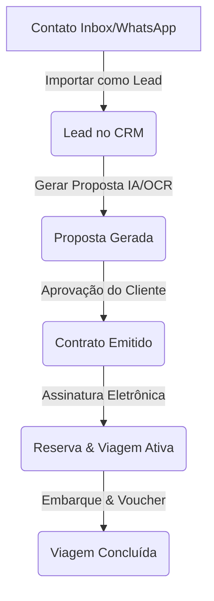

# 11. Actions, Flows and Business Rules (Fluxos de Negócio)

Este relatório mapeia as transações, ações de cliques da interface e regras de negócio operacionais no Turis.

---

## 1. Fluxo do Lead até o Pós-Venda

### 1.1 Regras de Transição e Idempotência
* **Importar como Lead:**
  * **Ação:** Criação do lead na tabela `crm_leads` associando o telefone e nome.
  * **Validação:** Evita duplicar registros se o telefone já estiver associado a outro lead ativo na agência.
* **Geração de Proposta:**
  * **Ação:** A Edge Function `ai-message-processor` compila as mensagens anteriores do chat para extrair passageiros, destinos e budget, criando uma proposta real ligada ao lead.

---

## 2. Fluxo Financeiro e Conciliação de Caixa

* **Demonstração do Resultado (DRE):**
  * **RPC:** A RPC Postgres `calculate_dre_summary` processa entradas e saídas pagas da agência de forma transacional no banco de dados.
* **Fluxo de Caixa:**
  * Abertura e fechamento de caixa dependem de registros atômicos em `cash_registers` para impedir inconsistências de saldo ao rodar reloads de página.
