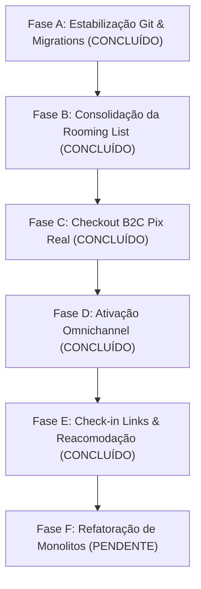

# Estado Atual do Roadmap de Estabilização & Auditoria Forense

Este documento serve como a fonte de verdade sobre o progresso das Fases Corretivas do TravelAgencias/Turis. Ele descreve o que já foi implantado fisicamente no banco de dados e no frontend, e o que permanece pendente.

---

## 📊 Progresso Geral

- **Total de Fases Planejadas:** 6
- **Concluídas:** 5 (Fases A, B, C, D, E)
- **Pendentes:** 1 (Fase F)

---

## ✅ Fases Concluídas (Prontas para Produção)

### 1. Fase A — Estabilização Git & Migrations

- **Objetivo:** Rastrear todas as migrações paralelas criadas, limpar o diretório git e validar o typecheck geral.
- **Entregas:**
  - Inclusão das migrações `20260624*` no controle de versão.
  - Correção de stubs e tipagens quebradas em abas de voo e confirmações de roteiros.
  - Typecheck e build de produção normalizados.

### 2. Fase B — Consolidação da Rooming List

- **Objetivo:** Unificar as informações de acomodação de grupos em uma tabela normalizada (`boarding_rooming_list`), removendo a coluna JSONB instável em `group_tours`.
- **Entregas:**
  - Migration `20260625000001_rooming_list_consolidation.sql` com migração automática de dados históricos.
  - Exclusão física da coluna obsoleta `rooming_list` da tabela `group_tours`.
  - Refatoração da UI Drag and Drop de quartos para realizar chamadas CRUD no banco relacional.

### 3. Fase C — Checkout B2C Pix Real

- **Objetivo:** Acabar com o mock do comprovante Pix no formulário público de checkout, implementar upload real e consentimento LGPD.
- **Entregas:**
  - Criação do bucket público de Storage `payment-receipts` com RLS seguro.
  - Criação do RPC seguro `enroll_public_tour` (com `SECURITY DEFINER`) para isolar a criação de leads e transação de assentos.
  - Upload físico do comprovante Pix e salvamento em `group_tour_enrollments.receipt_url`.
  - Checkbox de LGPD obrigatório e chave Pix dinâmica da agência.

### 4. Fase D — Ativação Omnichannel

- **Objetivo:** Solucionar a consulta quebrada por coluna inexistente nas Edge Functions de sincronia do Gmail e prover envio transacional seguro via Resend API.
- **Entregas:**
  - Edge Functions `gmail-send` e `gmail-sync` corrigidas para usar a coluna real `integrations_config` da tabela `agencies`.
  - Fallback automático para Resend API quando não houver conexão de tokens de e-mail do Gmail OAuth.
  - Chat de suporte do agente estendido para permitir preenchimento manual de e-mail do fornecedor (`replyType === 'supplier'`).
  - Deploy remoto das Edge Functions realizado.

### 5. Fase E — Check-in Links & Reacomodação

- **Objetivo:** Prover uma central e-checkin para o passageiro com links oficiais de companhias aéreas, canal de emergência e widget de confirmação de voos alternativos.
- **Entregas:**
  - Tabelas `checkin_links` e `boarding_events` criadas via migração `20260625000003_checkin_links_and_boarding_events.sql` com RLS isolado.
  - RPC `get_public_boarding_card_details` que entrega informações atômicas consolidadas de voo ao passageiro de forma anônima.
  - Calculador dinâmico de links de check-in para LATAM, GOL e Azul com parâmetros e overrides definidos por agentes no painel.
  - Fluxo de reacomodação com aceite do cliente, que atualiza o status dos itinerários de voo de forma atômica no banco (`accept_public_reaccommodation`).
  - Botões de emergência "Meu voo atrasou/cancelou" que abrem chamados de prioridade alta no painel de suporte de forma imediata (`submit_emergency_flight_issue`).

---

## ⏳ Fases Pendentes (Próximos Passos)

### 6. Fase F — Refatoração de Monolitos (Prioridade Baixa)

- **Problema Detectado:** O arquivo da rota `client.trips.$id.tsx` (Portal do Cliente para desktop) está excessivamente grande, contendo mais de 1900 linhas de código e acumulando múltiplas responsabilidades (abas, modais de confirmação, layouts, tabelas de voo).
- **Ações Planejadas:**
  - Decompor o arquivo principal em sub-componentes modulares e reutilizáveis organizados em `src/components/portal/`.
  - Reduzir o tamanho da rota para menos de 400 linhas, mantendo o build íntegro e facilitando manutenções futuras.
- **Critério de Pronto:** Rota `client.trips.$id.tsx` limpa, typecheck com 0 erros e build bem-sucedido.
