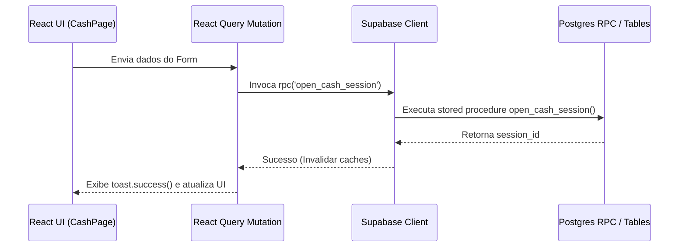

# Rotas da Interface e Handlers (Turis)

Este documento cataloga a estrutura de navegação do frontend, os formulários de entrada de dados, os hooks do React Query, as mutações e a integração com as funções servidoras do banco de dados (RPCs).

---

## 1. Mapeamento de Rotas e Componentes Associados

O módulo financeiro está estruturado sob a rota base [agency.$slug.financial.tsx](file:///c:/Users/Excel%C3%AAncia%20Tour%20SMO/.gemini/antigravity-ide/scratch/travelagencias/src/routes/agency.$slug.financial.tsx) e suas sub-rotas correspondentes:

| Rota                                     | Tipo      | Componente Principal       | Responsabilidade                                                                                      |
| :--------------------------------------- | :-------- | :------------------------- | :---------------------------------------------------------------------------------------------------- |
| `/agency/$slug/financial`                | Layout    | `FinancialLayout`          | Renderiza as abas de navegação, botão de administração e herda o contexto da agência.                 |
| `/agency/$slug/financial/cash`           | Sub-rota  | `CashPage`                 | Tela principal de fluxo de caixa, sangria, aporte, vales, abertura e fechamento de expediente diário. |
| `/agency/$slug/financial/reconciliation` | Sub-rota  | `ReconciliationPage`       | Validação física de comprovantes de clientes, quitação de parcelas e conciliação bancária.            |
| `/agency/$slug/financial/dre`            | Sub-rota  | `DREPage`                  | Exibição gerencial agrupada por competência das receitas e despesas da agência.                       |
| `/agency/$slug/financial/invoices`       | Sub-rota  | `InvoicesPage`             | Gerenciamento de faturamento de Notas Fiscais eletrônicas de serviços (NFS-e).                        |
| `/agency/$slug/financial/groups`         | Sub-rota  | `GroupFinancialsDashboard` | Rentabilidade consolidada comparativa por excursão ativa.                                             |
| `/agency/$slug/trips/$id/financial`      | Rota Trip | `TripFinancialPage`        | KPIs financeiros, fluxo de pagamento e faturamento de uma venda específica.                           |

---

## 2. Formulários, Validações e Schemas (React Hook Form)

Os formulários utilizam `react-hook-form` com validação síncrona via `zodResolver`:

- **Abertura de Caixa (`openSchema`)**: Exige `openingBalance` (numérico $\ge 0$) e `notes` opcionais.
- **Fechamento de Caixa (`closeSchema`)**: Exige `reportedBalance` (saldo contado) para apurar diferença cambial ou quebra de caixa.
- **Transação Avulsa (`txSchema`)**: Exige `amount` positivo, `payment_method` selecionado e `notes` (mínimo de 2 caracteres descrevendo o lançamento).
- **Conciliação Manual (`reconciliationSchema`)**: Requer `operator_id`, `client_paid_agency`, `client_paid_operator` e `commission_rate`.

---

## 3. Mutações e Integração com RPCs (React Query)

O frontend interage com o backend Supabase através de chamadas diretas de mutação:

- **Gatilho de OCR (`handleFileOcr`)**: Faz o upload do arquivo para a Edge Function `/functions/v1/ocr-boleto`, extrai os metadados fiscais via LLM/OCR, e realiza a mutação para inserir diretamente a despesa na tabela `cash_transactions`.
- **Visualização de Anexos (`handleViewReceipt`)**: Helper de storage que assina URLs de buckets privados (`financial-receipts`) para exibição sob demanda.
