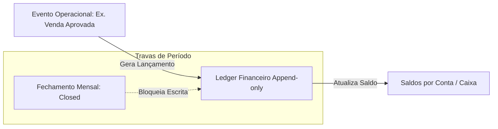

# Arquitetura Alvo (Target Architecture)

Este documento projeta a nova arquitetura do subsistema financeiro do TravelOS, com foco em segurança transacional, ledger imutável, separação de base de dados e cálculos isolados no backend.

---

## 1. Topologia da Nova Arquitetura Financeira

A nova proposta separa as operações do sistema em duas grandes camadas:

1. **Camada de Negócios (Operacional)**: Viagens, Inscrições em Grupos, Notas Fiscais e Planos de Parcelamento. São manipuláveis pelos usuários respeitando permissões RBAC.
2. **Camada de Ledger Financeiro (Razão Imutável)**: Livro-razão do tipo _append-only_ que armazena lançamentos de débito e crédito gerados a partir de eventos operacionais aprovados. Uma transação nesta camada não pode ser editada ou removida, apenas neutralizada por um lançamento de estorno de sinal oposto.



---

## 2. Modelagem de Dados do Livro-Razão (Ledger)

```sql
CREATE TABLE public.financial_ledger_entries (
  id           uuid PRIMARY KEY DEFAULT gen_random_uuid(),
  agency_id    uuid NOT NULL REFERENCES public.agencies(id) ON DELETE CASCADE,
  account_code text NOT NULL, -- Código estruturado da conta contábil (ex: 1.1.1.01)
  debit_amount  numeric(14,2) NOT NULL DEFAULT 0.00,
  credit_amount numeric(14,2) NOT NULL DEFAULT 0.00,
  entry_date   timestamptz NOT NULL DEFAULT now(),
  description  text NOT NULL,
  source_event text NOT NULL, -- Ex: 'sale.approved', 'payable.paid'
  source_id    uuid NOT NULL, -- ID do registro operacional de origem
  created_at   timestamptz NOT NULL DEFAULT now()
);
```

---

## 3. Lógica Backend de Comissionamento Progressivo

Para suportar o comissionamento escalonado progressivo exigido na Seção 3.7 do PRD, implementaremos a seguinte fórmula no banco de dados:

```sql
CREATE OR REPLACE FUNCTION public.calculate_progressive_commission(
  _billing numeric,
  _ranges jsonb
) RETURNS numeric AS $$
DECLARE
  v_range jsonb;
  v_comm numeric := 0;
  v_min numeric;
  v_max numeric;
  v_pct numeric;
  v_applicable numeric;
BEGIN
  -- Iterar sobre faixas marginais de faturamento
  FOR v_range IN SELECT * FROM jsonb_array_elements(_ranges)
  LOOP
    v_min := (v_range->>'min')::numeric;
    v_max := (v_range->>'max')::numeric;
    v_pct := (v_range->>'pct')::numeric;

    IF _billing > v_min THEN
      -- Determinar valor aplicável a esta fatia
      IF v_max IS NULL OR _billing <= v_max THEN
        v_applicable := _billing - v_min;
      ELSE
        v_applicable := v_max - v_min;
      END IF;
      v_comm := v_comm + (v_applicable * v_pct / 100);
    END IF;
  END LOOP;

  RETURN ROUND(v_comm, 2);
END;
$$ LANGUAGE plpgsql IMMUTABLE;
```

---

## 4. Isolamento Multi-tenant Avançado (RLS)

Todas as novas tabelas adotarão RLS atreladas a funções `SECURITY DEFINER` do banco de dados que validam se o `auth.uid()` pertence à agência informada (`agency_id`) e se o escopo de atuação do usuário condiz com o seu nível de acesso.
No caso de documentos de comprovantes e arquivos sensíveis, as buscas serão realizadas de maneira estrita, impedindo download direto sem assinatura da URL de expiração curta.
