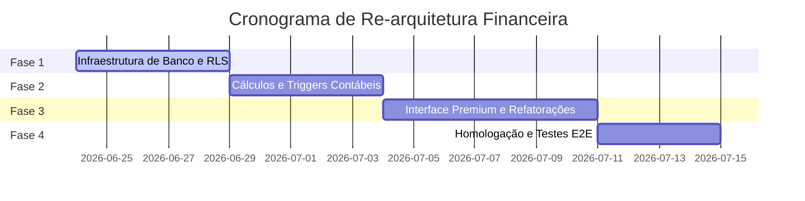

# Plano Mestre de Implementação (Master Implementation Plan)

Este documento estabelece o cronograma de execução, etapas de homologação e critérios de aceitação para a restruturação completa do subsistema financeiro no TravelOS.

---

## 1. Cronograma de Fases e Sprints

### Fase 1: Infraestrutura de Banco e RLS (Sprint 1)

- **Objetivos**:
  - Criação física das tabelas `financial_ledger_entries`, `financial_categories`, `seller_adjustments` e `monthly_closing_periods`.
  - Habilitação e testes unitários de políticas de isolamento multi-tenant (RLS).
- **Entregáveis**: Arquivo de migração SQL (`.sql`) com o esquema novo completo e as regras de segurança aplicadas.

### Fase 2: Cálculos e Gatilhos Contábeis no Servidor (Sprint 2)

- **Objetivos**:
  - Implementação da lógica de comissionamento escalonada progressiva em RPC/triggers.
  - Desenvolvimento da rotina de bloqueio físico de alteração de lançamentos em meses já fechados (`monthly_closing_periods`).
- **Entregáveis**: Stored procedures de comissões, fechamento de períodos e triggers de auditoria integrados.

### Fase 3: Interface Premium e Expulsão de Mocks (Sprint 3)

- **Objetivos**:
  - Substituição completa de todos os dados estáticos (mocks) em `reconciliation.tsx` por leituras diretas do Supabase.
  - Criação da interface de conciliação de operadoras e gestão de planos de comissões.
  - Ajuste estético das telas para o padrão **Light Editorial SaaS / Flat Premium** (bordas finas, sem sombras genéricas).
- **Entregáveis**: Telas de fluxo de caixa, conciliação e DRE integradas à nova API do backend.

### Fase 4: Garantia de Qualidade e Homologação (Sprint 4)

- **Objetivos**:
  - Rodar testes automatizados de concorrência e integridade das fórmulas.
  - Validação manual de isolamento de agências (RLS) e exportação de relatórios.
- **Entregáveis**: Walkthrough final validado com sucesso e logs de execução limpos.

---

## 2. Critérios de Pronto (Definition of Done)

> [!IMPORTANT]
> Uma fase ou tarefa só será considerada concluída após passar pelos seguintes checks:
>
> 1. **Zero Mocks**: Nenhum arquivo do frontend ou backend deve conter dados fictícios ou estáticos simulando comportamento.
> 2. **Cálculos no Servidor**: Toda aritmética crítica (comissões, margem de grupos, taxas) deve ser processada no Postgres/Edge Functions.
> 3. **Políticas de RLS Ativas**: Garantir que nenhum agente tenha acesso a informações de vendas ou comissões de outros agentes de forma ilícita.
> 4. **Logs de Auditoria**: Qualquer alteração manual ou exclusão lógica deve gerar uma linha correspondente no log de eventos contábeis.
