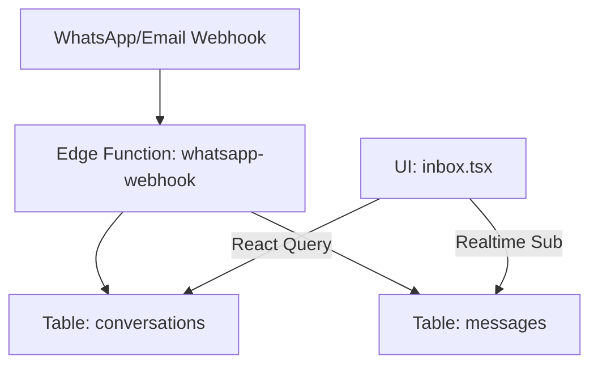
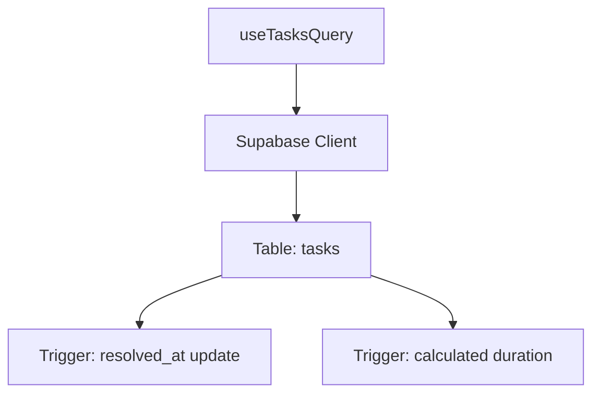

# 07 Arquitetura Esperada vs Atual

## 1. Módulo Inbox e Omnichannel

### Arquitetura Esperada (Inbox V2 Canônico)

### Arquitetura Atual (Constatada)
* O webhook de mensagens de entrada (`supabase/functions/whatsapp-webhook`) ainda grava no schema legado: `omnichannel_sessions` e `omnichannel_messages`.
* A nova tela de Inbox (`src/routes/agency.$slug.inbox.tsx`) faz queries em `conversations` e `messages` (migration `20260801000003`).
* **Consequência:** As mensagens em tempo real que chegam do WhatsApp não aparecem na nova caixa de entrada. O sistema de mensageria está desconectado.

---

## 2. Gestão de Tarefas (Task Management V2)

### Arquitetura Esperada

### Arquitetura Atual (Constatada)
* A arquitetura foi 100% migrada da antiga tabela `legacy_agent_tasks` para a tabela de tasks nova (`tasks`).
* As views (`ListView`, `CalendarView`, etc.) consultam o hook `useTasksQuery` que consome a tabela correta.
* Os tipos TS estão locais em `task.types.ts` devido à desatualização do `types.ts` gerado pelo Supabase CLI.
