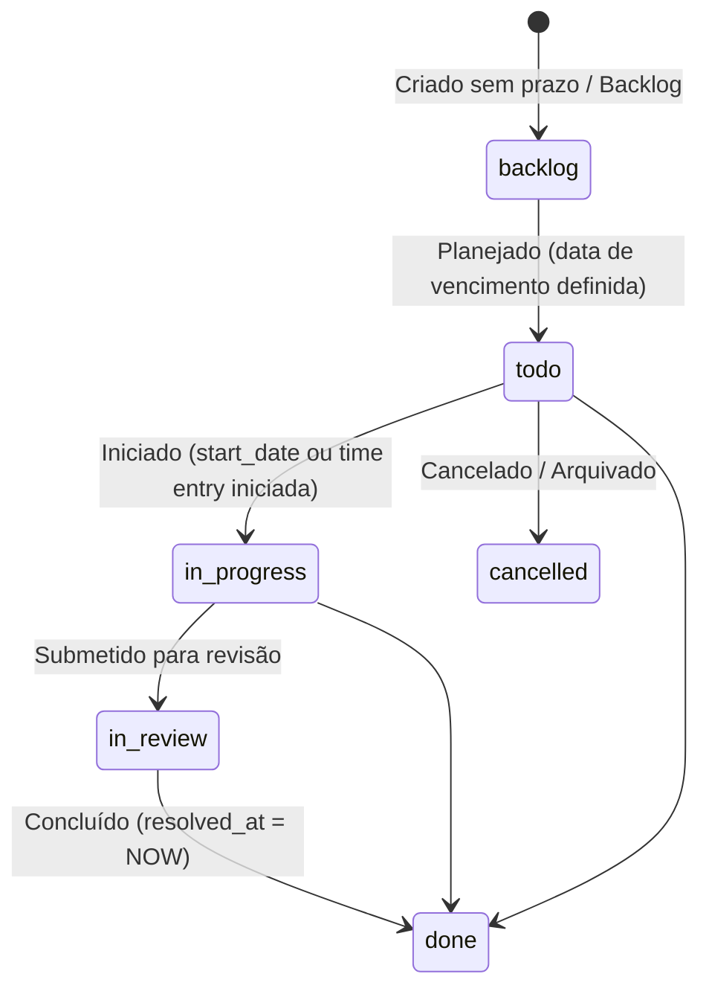
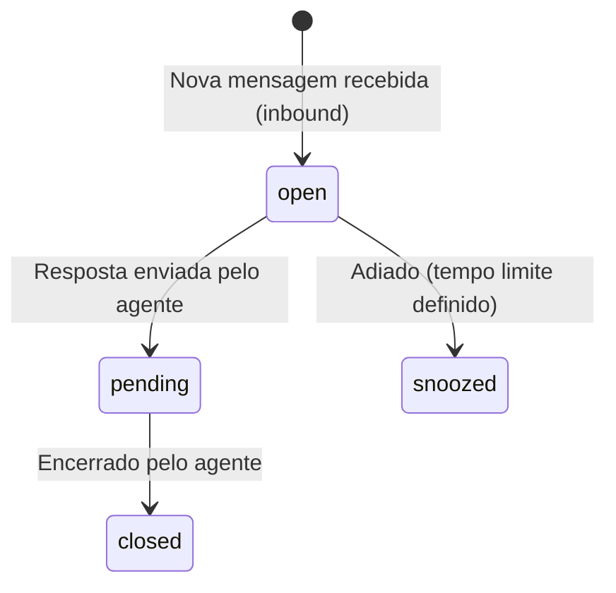

# 12 Regras de Negócio e Máquinas de Estado

Neste documento detalhamos o fluxo de transição de estados dos principais ciclos de vida do sistema e as triggers correspondentes no banco de dados.

---

## 1. Máquina de Estado de Tarefas (Tasks)

### Regras Críticas Associadas:
1. **Atualização Automática de `resolved_at`:** Disparada via trigger SQL sempre que o status muda para `done`. Se retrocedido de `done` para outro status, `resolved_at` é limpo (`NULL`).
2. **Registro de Carga de Trabalho:** O `estimated_minutes` e o `actual_minutes` de tempo logado (`task_time_entries`) são consolidados para gerar relatórios reais em `WorkloadView.tsx` e `ReportsView.tsx`.

---

## 2. Máquina de Estado de Conversas (Inbox Omnichannel)

### Regras Críticas Associadas:
1. **Auto-vínculo com Lead/Cliente:** O número de telefone do contato inbound é verificado na tabela `contacts`. Se houver correspondência exata, a conversa é vinculada ao cliente existente. Caso contrário, um novo contato é gerado no banco.
