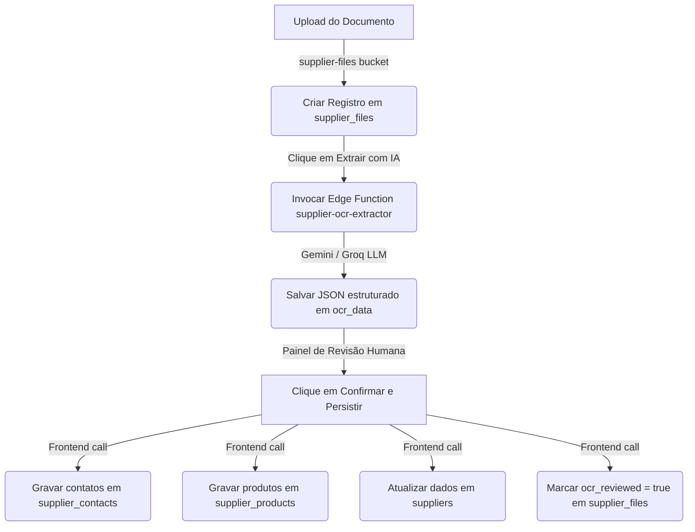

# 08. Processamento OCR, Idempotência e Ingestão

Este relatório analisa a integridade do pipeline de reconhecimento óptico de caracteres (OCR) por inteligência artificial e a persistência de parceiros, contatos e produtos no banco de dados.

## 1. Mapeamento do Pipeline de OCR e Ingestão

O fluxo operacional de importação de dados de fornecedores via OCR ocorre através das seguintes etapas:

## 2. Lacunas de Segurança, Integridade e Concorrência

1. **Ausência de Chaves de Idempotência:** Não há geração ou validação de chaves de idempotência (Idempotency Keys) em nenhuma das etapas do pipeline. Se a requisição HTTP falhar na resposta mas for concluída no banco, ou se o usuário clicar duas vezes em "Confirmar", o sistema executará comandos redundantes.
2. **Duplicação de Contatos e Produtos:** Como detalhado no relatório `06`, o manipulador do frontend realiza inserções diretas no banco em loops paralelos de forma não transacional. Se o mesmo documento for confirmado mais de uma vez (ou em abas diferentes), os contatos e produtos serão cadastrados repetidamente na base de dados, poluindo o CRM e o catálogo.
3. **Ausência de Hashing de Arquivo:** O sistema não calcula o checksum (MD5 ou SHA-256) do arquivo enviado. É possível carregar o mesmo documento (ex: mesma planilha de tarifário) repetidas vezes, gerando custos desnecessários de armazenamento e chamadas redundantes de IA.
4. **Sem Tratamento de Rollback:** Por não ser uma operação encapsulada em uma transação SQL (ou RPC com controle transacional), qualquer falha de rede ou validação no meio do salvamento de produtos deixará os contatos já salvos gravados no banco. O operador precisará reiniciar a revisão e a nova tentativa duplicará as primeiras inserções bem-sucedidas.
5. **Falta de Indicadores de Auditoria:** O banco de dados não registra metadados de auditoria do processamento de IA:
   * Não salva qual modelo foi utilizado (Gemini ou Groq).
   * Não salva a pontuação de confiança (Confidence Score) da extração de campos estruturados.
   * Não registra qual operador/agente aprovou os dados finais, apenas atualizando a flag `ocr_reviewed`.
6. **Mapeamento de Aliases e Duplicação de Fornecedores:** O OCR tenta extrair dados para o parceiro em que o arquivo foi anexado. Porém, não há lógica de aliases ou validação inteligente para alertar se os contatos inseridos já pertencem a outro fornecedor, ou se o e-mail/WhatsApp extraído está duplicado na base de dados.
