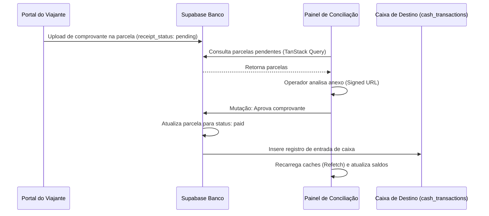
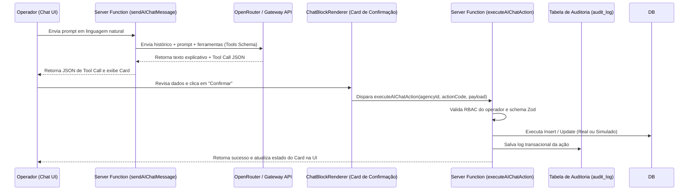

# Rastreamento de Fluxos e Integrações (Turis)

Este documento descreve detalhadamente o rastreamento dos dois fluxos principais auditados neste round: Conciliação de Recibos e o Motor de Ações de Inteligência Artificial.

---

## 1. Rastreamento de Fluxos Ponta a Ponta

### 1.1 Fluxo: Conciliação Diária de Recibos Pix

Este fluxo rastreia a quitação de parcelas pelos viajantes até o fechamento contábil.

- **Rastreabilidade**:
  - **Etapa 1**: Inscrição / Upload -> Portal público (magic link token).
  - **Etapa 2**: Visualização -> Rota `/agency/$slug/financial/reconciliation`.
  - **Etapa 3**: Validação e Lançamento -> `approveReceipt.mutate` no frontend -> Insere em `cash_transactions` e atualiza `payment_installments` no banco.
  - **Estado**: **REAL PONTA A PONTA**

---

### 1.2 Fluxo: Motor de Ações do Chat de IA (Action Execution)

Este fluxo mapeia a interpretação de mensagens em linguagem natural convertendo em comandos de persistência de dados.

- **Rastreabilidade**:
  - **Interpretação**: `sendAIChatMessage` (tanstack start service).
  - **Exibição do Card**: `ChatBlockRenderer.tsx` (ConfirmationCard).
  - **Confirmação e Execução**: `executeAIChatAction` (tanstack start service).
  - **Persistência**: `audit_log` e tabelas de CRM/Trips.
  - **Estado**: **PARCIAL** (Funciona ponta a ponta para ações do CRM como `create_lead`, mas simula com UUIDs aleatórios ações de cotação ou contratos).
