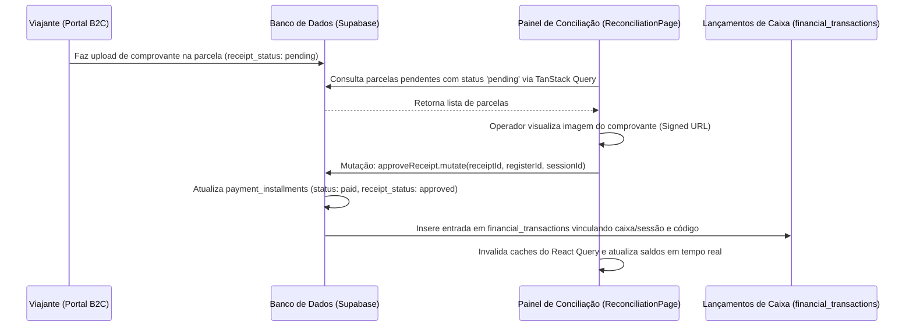
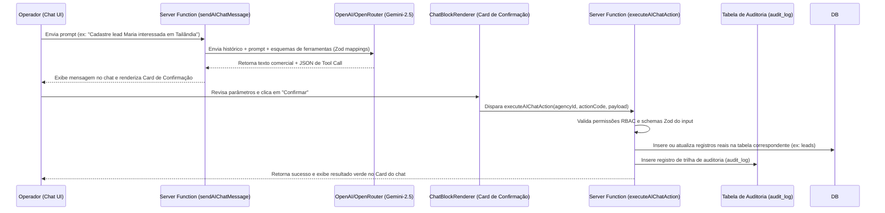

# Rastreamento de Fluxos e Integrações — Rodada 2 (Turis)

Este documento detalha o rastreamento técnico de fluxos ponta a ponta e integrações externas no ecossistema do Turis.

---

## 1. Fluxo de Conciliação Diária de Recibos Pix

Este fluxo envolve a auditoria física de depósitos enviados por clientes até a efetivação no caixa/banco da agência.

- **Rastreabilidade**:
  - **Visualização**: Rota `/agency/$slug/financial/reconciliation`.
  - **Persistência**: `approveReceipt.mutate` no frontend -> executa updates em `payment_installments` e inserts em `financial_transactions`.
  - **Conclusão**: **REAL PONTA A PONTA**.

---

## 2. Fluxo do Motor de Ações do Chat de IA (Action Execution)

Mapeia o processamento de texto em linguagem natural convertendo em chamadas de escrita estruturadas nas tabelas de negócios da plataforma.

- **Rastreabilidade**:
  - **Chamador**: `AIChatPanel.tsx` -> `sendAIChatMessage` em `ai-chat.functions.ts`.
  - **Card de Consentimento**: `ChatBlockRenderer.tsx` (`ConfirmationCard`).
  - **Execução Contábil/Operacional**: `executeAIChatAction` em `ActionExecutor.ts`.
  - **Conclusão**: **REAL PONTA A PONTA** (As ações de geração de rascunhos de contratos e vouchers agora inserem dados físicos no banco local nas tabelas `contracts` e `vouchers`, em vez de simularem com UUIDs aleatórios em memória).
