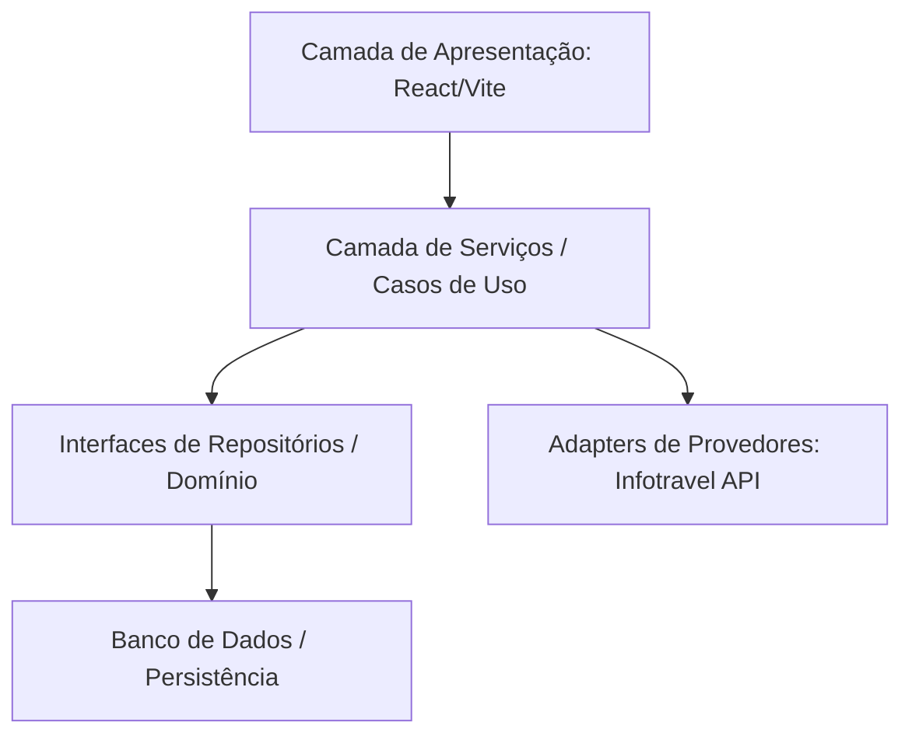
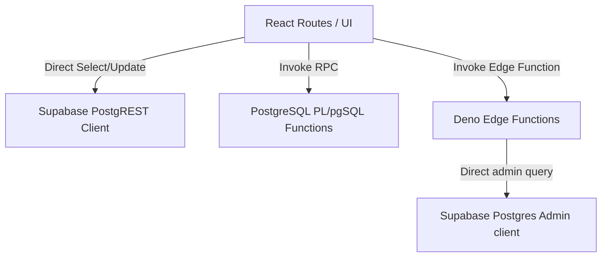

# 05. Mapa de Arquitetura: Esperada versus Encontrada

Este documento descreve a discrepância estrutural entre o modelo arquitetural ideal (Arquitetura Limpa desacoplada) e o padrão físico implementado no ecossistema do **Turis**.

---

## 1. Arquitetura Esperada (Ideal)

No design de um sistema corporativo SaaS robusto e altamente escalável, a separação de responsabilidades deve seguir regras rígidas:

* **UI (Apresentação)**: Apenas lê estados e dispara comandos. Não possui conhecimento das queries SQL, tabelas ou mapeamentos da API do provider.
* **Services (Casos de Uso)**: Orquestra lógica de negócios de forma agnóstica de provedores ou canais.
* **Domain (Entidades/Invariantes)**: Define as regras de validação (ex: conexões máximas, restrições de pernoite).
* **Adapters/Gateways**: Abstrai as peculiaridades da API do parceiro (Infotravel DTO -> Canonical DTO).

---

## 2. Arquitetura Encontrada (Real)

A realidade física das rotas de cotação e de caixa diário revela um acoplamento direto de tabelas e orquestrações no banco:

### Análise de Desvios Estruturais:

1. **Persistência Direta da UI (PostgREST)**:
   * **Ocorrência**: Em [src/routes/agency.$slug.financial.cash.tsx](file:///c:/Users/Excel%C3%AAncia%20Tour%20SMO/.gemini/antigravity-ide/scratch/travelagencias/src/routes/agency.$slug.financial.cash.tsx) e [src/routes/agency.$slug.quotes.$id.tsx](file:///c:/Users/Excel%C3%AAncia%20Tour%20SMO/.gemini/antigravity-ide/scratch/travelagencias/src/routes/agency.$slug.quotes.$id.tsx), a UI executa inserções, atualizações e seleções diretamente nas tabelas (`cash_transactions`, `cash_registers`, `package_candidates`, `simulation_runs`) usando o cliente JS do Supabase.
   * **Consequência**: Qualquer alteração no schema físico do banco exige refatorações em cascata nas rotas visuais da UI.
2. **Orquestração Transacional delegada ao PostgreSQL (RPC/Triggers)**:
   * **Ocorrência**: A lógica crítica de conversão (`convert_quote_to_proposal`) e logs invioláveis (`process_cash_audit_log`) foram movidos para funções Pl/pgSQL e triggers de banco.
   * **Avaliação**: **Positivo para consistência de dados**. Embora aumente a dependência do dialeto Postgres, garante que as restrições físicas do banco (como chaves exclusivas e transações) protejam a integridade operacional mesmo sob queda de rede.
3. **Edge Functions como Controladores Híbridos**:
   * **Ocorrência**: A Edge Function `ai-quote-engine` atua como orquestrador, misturando a extração lógica de intenção do lead, chamadas HTTP ao `infotravel-connector` e cálculos heurísticos de scorecard na mesma rotina linear.

---

## 3. Diretrizes de Evolução Sem Quebras

Para suportar o crescimento sem conflitos de merge ou incompatibilidades, novos módulos devem:
* **Abstrair Queries Ricas em Repositórios**: Criar classes/funções utilitárias sob `src/services/` para encapsular seleções complexas, em vez de espalhar `.select("*").eq(...)` no meio dos componentes React.
* **Manter Regras Críticas no Backend**: Continuar delegando transações complexas a RPCs protegidas e restrições de integridade física no banco, que atuam como a última e mais forte linha de defesa da integridade dos dados.
