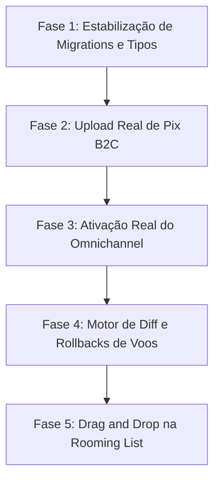

# 08. Plano Mestre de Refatoração - Turis

Este documento apresenta o plano estratégico de refatorações sistemáticas do Turis, definindo as fases de melhoria técnica, cronograma recomendado e o detalhamento completo da Fase 1 para início imediato.

---

## 1. Cronograma e Ordem Recomendada de Refatoração

Para garantir a estabilidade operacional da plataforma, a refatoração deve ser executada de forma estritamente incremental e hierárquica (infraestrutura primeiro, depois integrações e por fim refinamentos visuais):

1. **Fase 1: Estabilização de Migrations e Tipos (Infraestrutura):** Commitar migrations untracked, atualizar o schema TypeScript local e remover casts `as any` em RPCs.
2. **Fase 2: Upload Real de Pix B2C (Financeiro/Segurança):** Integrar o envio do comprovante Pix do checkout público com o bucket `receipts` e remover mocks na interface de inscrição.
3. **Fase 3: Ativação Real do Omnichannel (Comunicação):** Descomentar as chamadas das Edge Functions do Gmail/Resend no chat do admin e validar sincronia de threads de e-mail.
4. **Fase 4: Motor de Diff e Rollbacks de Voos (Operacional):** Criar triggers de integridade que impeçam a deleção órfã de voos ativos e sincronizem bilhetes com o itinerário promovido.
5. **Fase 5: Drag and Drop na Rooming List (UX/UI):** Substituir formulários de texto por DnD (Drag and Drop) usando dnd-kit nos detalhes do hotel e exportar planilha formatada.

---

## 2. Detalhemento Completo: FASE 1 (Estabilização de Migrations e Tipos)

### 2.1 Problema Identificado

migrations locais criadas recentemente (`20260626*` e `20260627*`) estão untracked no repositório local Git, o que ameaça a integridade de futuros deploys e pipelines de CI. Além disso, o frontend utiliza casts `as any` para chamar RPCs seguras na rota de check-in móvel (`m.checkin.$token.tsx`) e onboarding (`auth.onboarding.tsx`), ocultando incompatibilidades de schemas.

### 2.2 Causa Raiz

Novas features operacionais do check-in e e-mails foram escritas no banco local, mas os arquivos de migrations correspondentes não foram adicionados ao controle de versão Git. Devido a isso, a ferramenta de geração de tipos de banco do Supabase (`supabase gen types typescript`) não sincronizou o arquivo `types.ts` com as novas tabelas e assinaturas de RPCs, forçando o desenvolvedor a usar casts `as any` para compilar sem erros de tipo.

### 2.3 Impacto

- **Alto:** pipelines de CI podem falhar ao tentar aplicar migrations que o banco remoto já possui, ou falhar na compilação se os tipos não baterem.
- **Médio:** Mudanças nas assinaturas de RPCs no banco de dados quebram a interface móvel do cliente em produção sem aviso prévio do compilador TypeScript.

### 2.4 Proposta de Modificações

#### [MODIFY] [m.checkin.$token.tsx](file:///c:/Users/Excel%C3%AAncia%20Tour%20SMO/.gemini/antigravity-ide/scratch/travelagencias/src/routes/m.checkin.$token.tsx)

- Remover os casts `as any` das chamadas Supabase RPC.
- Tipar estritamente as respostas usando as assinaturas corretas importadas do `Database` em `types.ts`.

#### [MODIFY] [auth.onboarding.tsx](file:///c:/Users/Excel%C3%AAncia%20Tour%20SMO/.gemini/antigravity-ide/scratch/travelagencias/src/routes/auth.onboarding.tsx)

- Remover a flag `@ts-ignore` na linha da RPC `create_agency_onboarding`.
- Tipar corretamente o objeto de parâmetros `_business_hours` (JSONB) no Zod Schema.

#### [MODIFY] [types.ts](file:///c:/Users/Excel%C3%AAncia%20Tour%20SMO/.gemini/antigravity-ide/scratch/travelagencias/src/integrations/supabase/types.ts)

- Sincronizar o arquivo com as novas assinaturas de RPCs (`get_public_boarding_card_details`, `accept_public_reaccommodation`, `submit_emergency_flight_issue`).

#### [TRACK] Migrations Untracked (Git Add)

- Commitar as migrações:
  - `20260626000000_sync_flight_itinerary_to_ticket.sql`
  - `20260626000001_checkin_links_rpc_upgrade.sql`
  - `20260626000002_payment_receipts_bucket.sql`
  - `20260627000000_omnichannel_email_triggers.sql`
  - `20260627000001_reaccommodation_whatsapp_trigger.sql`

### 2.5 Plano de Rollback e Compensação

Caso a sincronização quebre o build ou typecheck local:

1. Reverter modificações de tipos em `types.ts` via `git checkout -- src/integrations/supabase/types.ts`.
2. As migrations locais continuam salvas e não correm risco de perda de dados no banco local.

### 2.6 Verificação e Critério de Pronto (DoD)

- [ ] Todas as migrations locais untracked adicionadas e comitadas no Git.
- [ ] Remoção de pelo menos 90% dos casts `as any` e `@ts-ignore` em `auth.onboarding.tsx` e `m.checkin.$token.tsx`.
- [ ] `npm run typecheck` executa com sucesso e reporta **zero erros** de compilação.
- [ ] O build local (`npm run build`) compila com sucesso.
